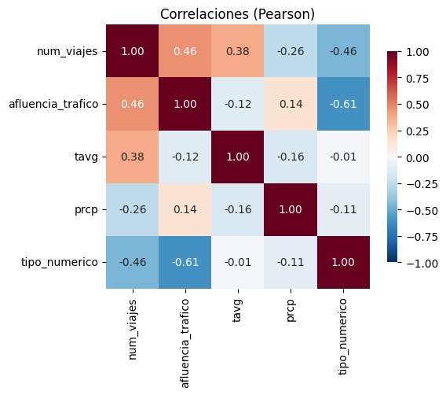
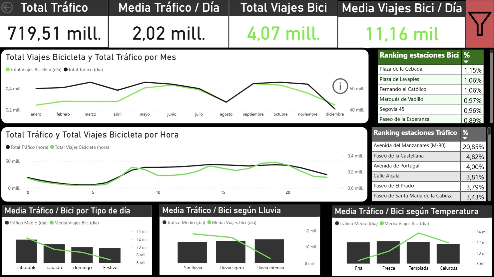
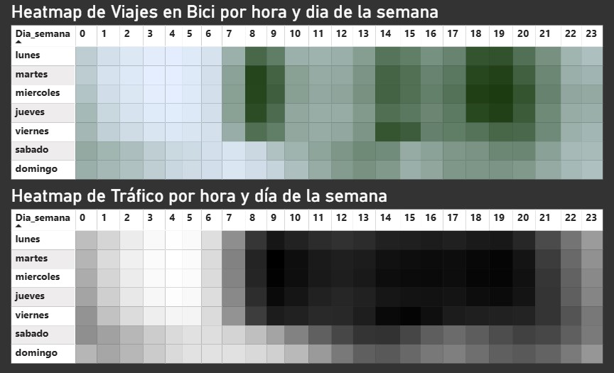
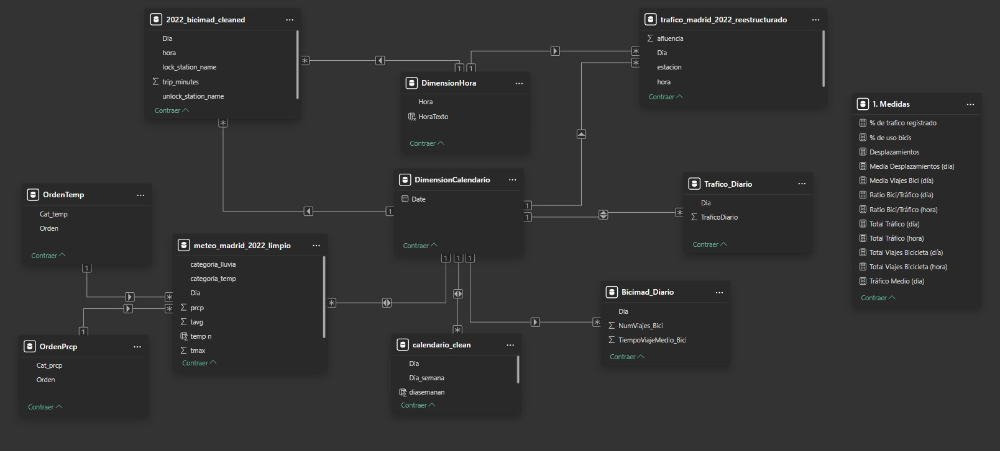

# Madrid Urban Mobility Analysis 2022: Weather and Calendar Impact on Transportation Patterns
**Author:** Andrés Nó Gómez
## Overview

This project presents a comprehensive analysis of urban mobility patterns in Madrid during 2022, integrating data from 4 independent sources to understand the relationships between bicycle usage, vehicular traffic, meteorological conditions, and calendar factors. The study combines exploratory data analysis (EDA), data integration, correlation analysis, and interactive dashboard development using Power BI.


The analysis encompasses over 4 million bicycle trips from BiciMad (Madrid's bike-sharing system), 719.5 million vehicle traffic records, daily meteorological data, and a complete labor calendar for Madrid. Through systematic data cleaning, transformation, and integration, this project reveals key insights about sustainable urban transportation patterns and their dependencies on external factors.

## Methodology

The project follows a structured approach consisting of three main phases:

1. **Individual EDA**: Each data source (bicycles, traffic, meteorology, calendar) were extracted and transformed separately and underwent independent exploratory analysis to understand data quality, patterns, and anomalies. As a result of this phase, four cleaned and reestructured datasets were generated. For reproducibility these were saved in CSV files and can be found in this repository.

2. **Data Integration and Pre-eliminary all around Analysis**: All cleaned datasets were merged at daily granularity using inner joins to ensure temporal coherence across all sources. A correlations analysis was carried out to ensure coherence and verification of initial supositions about the relationships among datasets.

3. **Analysis and Visualization**: A relational data model among the datasets was designed, useful metrics were calculated and interactive dashboards were developed in Power BI for comprehensive visualization.

## Repository Structure

### Data Analysis Notebooks
- `BiciMadrid2022_EDA.ipynb`: Exploratory data analysis of BiciMad trip data
- `TraficoMadrid2022_EDA.ipynb`: Analysis of Madrid traffic data
- `MeteoStatMadrid2022_EDA.ipynb`: Processing and analysis of meteorological data
- `CalendarioLaboralMadrid2022_EDA.ipynb`: Labor calendar data processing
- `AnalisisConjunto.ipynb`: Joint correlation analysis combining all data sources

### Dataset Folders
Each dataset is organized in its own folder containing EDA notebook, raw data, and processed data for reproducibility:

- `BiciMadrid/`: Bicycle sharing data analysis
  - `BiciMadrid2022_EDA.ipynb`: EDA notebook
    **IMPORTANT:** Due to the large size of this dataset, the files for BiciMadrid data could not be uploaded to the repository. They are available in the following DropBox links.
  - `2022_bicimad_RawData/`: Raw monthly CSV files with trip records. Available in https://www.dropbox.com/scl/fo/mms0mp64ifwtsomvjgfch/AOufhiwfJHFHIgJ_DS-SYEU?rlkey=0271wmz62du571jmjo0blm5se&st=ywsfu5v9&dl=0
  - `2022_bicimad_CleanData/`: Processed and cleaned bicycle data. Available in https://www.dropbox.com/scl/fo/12dtjc8ia21e9r0g3mh2f/APiP-GEKrLMU38AYceglS8M?rlkey=cditggzdfar190ikpzahihuyf&st=5ernjm58&dl=0
- `Trafico/`: Traffic data analysis
  - `TraficoMadrid2022_EDA.ipynb`: EDA notebook
  - `2022_aforoTrafico/Meses/`: Raw Excel files from traffic counting stations
  - `2022_aforoTrafico_CleanData/`: Restructured and cleaned traffic data
- `TiempoMetereologico/`: Meteorological data analysis
  - `MeteoStatMadrid2022_EDA.ipynb`: EDA notebook
  - `2022_meteostat_CleanData/`: Daily weather data from Meteostat API
- `CalendarioLaboral/`: Calendar data analysis
  - `CalendarioLaboralMadrid2022_EDA.ipynb`: EDA notebook
  - `calendario.csv`: Raw Madrid labor calendar
  - `calendario_clean.csv`: Processed calendar with day classifications

### Visualization and Reports
- `DASHBOARDS.pbix`: Power BI file containing interactive dashboards and data model
- `Report_English` and `Report_Spanish`: PDF documents containing the comprehensive analysis report with detailed explanations of methodology, findings, and conclusions from the entire project

## Key Findings

- **Scale**: 719.5M vehicle traffic records vs 4.07M bicycle trips (0.57% ratio)
- **Temporal patterns**: Bicycle usage shows marked seasonality (peak September, low August) and three daily peaks (08:00, 14:00, 19:00) aligned with work schedules, while traffic remains more stable
- **Day type impact**: Weekdays show 80% more bicycle activity and 57% more traffic than holidays, confirming economic activity dependency  
- **Weather sensitivity**: Bicycles are highly sensitive to temperature and precipitation (correlations: 0.38 temp, -0.26 rain), while traffic shows minimal weather sensitivity
- **Modal complementarity**: Positive correlation (0.46) indicates both modes respond similarly to urban mobility patterns, with systematic complementarity across all analyses

## Correlation Matrix



## Power BI Dashboards






## Technical Implementation

### Exploratory Data Analysis (EDA)
- Individual EDA notebooks for each dataset identify data quality issues, patterns, and anomalies
- Systematic approach to data cleaning including handling missing values, duplicates, and outliers
- Statistical profiling and visualization of key variables before integration
- Documentation of transformation decisions for reproducibility

### Power BI Data Model
The project implements a star schema data model in Power BI with dual granularity levels (daily and hourly). This architecture enables both aggregated trend analysis and detailed intra-daily pattern examination. Key technical features include:

- Automated daily aggregations using Power Query Group By operations
- Auxiliary dimension tables (DimensionCalendario, DimensionHora) for consistent temporal filtering
- Comprehensive metrics covering volume, proportion, trend, and data quality indicators
- Integration of multiple data sources maintaining temporal coherence through inner joins




## Data Sources

- **BiciMad**: EMT Madrid historical trip data (2017-2023)
- **Traffic**: Madrid Open Data "Traffic data since 2013"
- **Meteorology**: Meteostat Python API (Point and Daily data)
- **Calendar**: Madrid Open Data official labor calendar

## Requirements and Tools

### Required Software
- Python 3.8+
- Jupyter Notebooks or VS Code
- Power BI Desktop
- Git

### Python Libraries
```
pandas
numpy
matplotlib
seaborn
meteostat
```

### Technologies Used
- **Data Analysis**: Python (pandas, numpy)
- **Data Visualization**: matplotlib, seaborn, Power BI
- **Development Environment**: Jupyter Notebooks / VS Code
- **Data Integration**: Power Query
- **Statistical Analysis**: Pearson correlation, descriptive statistics
- **Data Sources**: Meteostat API, Madrid Open Data Portal


